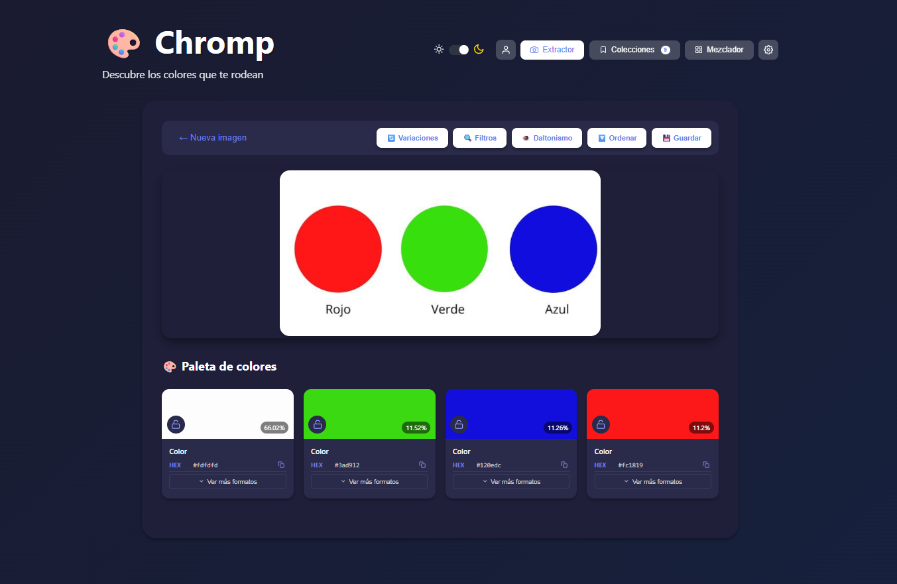

<div align="center">
  <br>
  
  <h1>🎨 Chromp</h1>
  <p><strong>Tu generador de paletas de colores inteligente</strong></p>
  <br>
  
  <!-- Badges -->
  <p>
    
    
    
    
  </p>
  
  <p>
    <a href="#-características">✨ Características</a> •
    <a href="#-novedades">🎯 Novedades</a> •
    <a href="#-tecnologías">🛠️ Tecnologías</a> •
    <a href="#-estructura">📁 Estructura</a> •
    <a href="#-instalación">🚀 Instalación</a> •
    <a href="#-cómo-usar">📖 Cómo usar</a> •
    <a href="#-api">🌐 API</a>
  </p>
  
  <br>
  
  <br>
  <br>
</div>

## 🌈 Descubre los colores que te rodean

**Chromp** es una aplicación web profesional que extrae paletas de colores armoniosas de cualquier imagen. Diseñada para diseñadores, desarrolladores y amantes del color que quieren descubrir, guardar y manipular combinaciones cromáticas perfectas.

> *"La vida es más bonita en color"* — Chromp

<br>

## ✨ Características principales

<div align="center">
  <table>
    <tr>
      <td align="center" width="200">
        <h1>📸</h1>
        <h3>Extracción real</h3>
        <p>Algoritmo K-means con Python + OpenCV para extraer colores dominantes de cualquier imagen</p>
      </td>
      <td align="center" width="200">
        <h1>🎲</h1>
        <h3>13 esquemas de color</h3>
        <p>Monocromático, complementario, análogo, triádico, tetrádico, tonos tierra, pastel, vibrante, oceánico, atardecer, neón, otoño y más</p>
      </td>
      <td align="center" width="200">
        <h1>📚</h1>
        <h3>Colecciones</h3>
        <p>Guarda, edita y organiza tus paletas favoritas</p>
      </td>
    </tr>
    <tr>
      <td align="center" width="200">
        <h1>🎨</h1>
        <h3>Mezclador avanzado</h3>
        <p>Combina dos paletas guardadas para crear nuevas combinaciones y guarda los resultados</p>
      </td>
      <td align="center" width="200">
        <h1>📊</h1>
        <h3>Estadísticas</h3>
        <p>Colores favoritos (con fallback a colores representativos), colores únicos y distribución por temperatura/saturación/luminosidad</p>
      </td>
      <td align="center" width="200">
        <h1>🌙</h1>
        <h3>Modo oscuro</h3>
        <p>Interfaz adaptable con tema claro/oscuro mediante variables CSS</p>
      </td>
    </tr>
    <tr>
      <td align="center" width="200">
        <h1>🔒</h1>
        <h3>Bloquear colores</h3>
        <p>Fija colores que te gustan y regenera solo los demás</p>
      </td>
      <td align="center" width="200">
        <h1>🔄</h1>
        <h3>Ordenar colores</h3>
        <p>Por tono, saturación, luminosidad o aleatorio</p>
      </td>
      <td align="center" width="200">
        <h1>👁️</h1>
        <h3>Simulación de daltonismo</h3>
        <p>Protanopia, deuteranopia, tritanopia y acromatopsia</p>
      </td>
    </tr>
    <tr>
      <td align="center" width="200">
        <h1>🔧</h1>
        <h3>Ajuste manual</h3>
        <p>Modifica tono, saturación y luminosidad de cada color individualmente</p>
      </td>
      <td align="center" width="200">
        <h1>🔄</h1>
        <h3>Variaciones</h3>
        <p>Genera 7 variantes de cualquier paleta (más claro, más oscuro, más saturado, etc.)</p>
      </td>
      <td align="center" width="200">
        <h1>🔍</h1>
        <h3>Filtros de color</h3>
        <p>Genera paletas con restricciones (sin rojos, solo cálidos, solo pastel, etc.)</p>
      </td>
    </tr>
    <tr>
      <td align="center" width="200">
        <h1>🏷️</h1>
        <h3>Nombres reales</h3>
        <p>Más de 70 nombres de colores reales (Coral, Turquesa, Azul noche, etc.)</p>
      </td>
      <td align="center" width="200">
        <h1>📋</h1>
        <h3>Múltiples formatos</h3>
        <p>Copia colores en HEX, RGB, HSL y CMYK con un solo clic</p>
      </td>
      <td align="center" width="200">
        <h1>📥</h1>
        <h3>Exportar datos</h3>
        <p>Backup completo de tus colecciones en JSON</p>
      </td>
    </tr>
    <tr>
      <td align="center" width="200">
        <h1>🔗</h1>
        <h3>Subida por URL</h3>
        <p>Pega enlaces de imágenes directamente</p>
      </td>
      <td align="center" width="200">
        <h1>📏</h1>
        <h3>Tamaño ajustable</h3>
        <p>Tarjetas pequeñas, medianas o grandes</p>
      </td>
      <td align="center" width="200">
        <h1>⚙️</h1>
        <h3>Configuración</h3>
        <p>Ajusta el número de colores y el tamaño de tarjetas</p>
      </td>
    </tr>
  </table>
</div>

<br>

## 🛠️ Tecnologías

<div align="center">
  <table>
    <tr>
      <th colspan="2">Frontend</th>
      <th colspan="2">Backend</th>
    </tr>
    <tr>
      <td align="center">
        
      </td>
      <td>Framework principal</td>
      <td align="center">
        
      </td>
      <td>Lenguaje backend</td>
    </tr>
    <tr>
      <td align="center">
        
      </td>
      <td>Animaciones</td>
      <td align="center">
        
      </td>
      <td>API REST</td>
    </tr>
    <tr>
      <td align="center">
        
      </td>
      <td>Iconos</td>
      <td align="center">
        
      </td>
      <td>Procesamiento imágenes</td>
    </tr>
    <tr>
      <td align="center">
        
      </td>
      <td>Manipulación de color</td>
      <td align="center">
        
      </td>
      <td>K-means clustering</td>
    </tr>
    <tr>
      <td align="center">
        
      </td>
      <td>Contenedores</td>
    </tr>
  </table>
</div>

<br>

## 📁 Estructura del Proyecto

```bash
📦 chromp
├── 📁 frontend
│   ├── 📁 public
│   ├── 📁 src
│   │   ├── 📁 components
│   │   │   ├── 📁 layout          # Header, ThemeToggle
│   │   │   ├── 📁 profile         # ProfilePanel, ProfileStats
│   │   │   ├── 📁 settings        # SettingsPanel
│   │   │   ├── 📁 upload          # UploadArea
│   │   │   ├── 📁 colors          # ColorCard, ColorAdjuster, VariationsModal, ColorBlindnessModal
│   │   │   └── 📁 common          # EmptyState, NameInputModal
│   │   ├── 📁 hooks               # useLocalStorage, usePaletteStats
│   │   ├── 📁 utils               # colorUtils, exportUtils, colorNames, colorBlindness
│   │   ├── 📁 pages               # ExtractorPage, CollectionsPage, MixerPage
│   │   ├── App.js
│   │   └── App.css
│   └── Dockerfile
│
├── 📁 backend
│   ├── app.py                     # API Flask
│   ├── extractor.py               # Algoritmo K-means
│   ├── requirements.txt           # Dependencias Python
│   └── Dockerfile
│
├── docker-compose.yml              # Orquestación de contenedores
└── README.md
└── start.bat                       # Archivo para ejecutar todo comodamente
